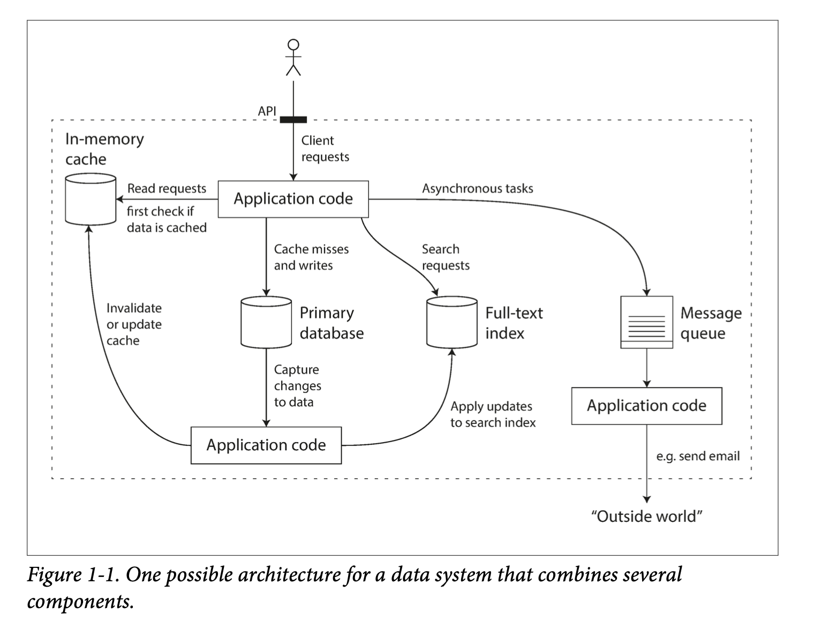

# Chapter 1
## Reliable, Scalable, and Maintainable Applications
**Reliable**: tolerating hardware & software faults; human error.
**Scalable**: Measuring load and performance; latency percentiles, throughput.
**Maintainable**: Operability, simplicity, evolvability.

<!-- {"width":542} -->

### Reliability
* The application performs the function that the user expected
* It can tolerate the user making mistakes or using the software in unexpected ways
* Its performance is good enough for the required use case, under the expected load and data volume
* The system prevents any unauthorised access and abuse
### Scalability
A system’s ability to cope with an increased load. It is not a one-dimensional label: systems grow in different directions called *load parameters*.

Important to measure response times on the client side due to effects such as *head-of-line blocking*.

Balance between *scaling up* and *scaling out*, which is to say vertical and horizontal scaling respectively.

*Elastic* systems automatically add computing resources when they detect a load increase, whereas other systems are scaled manually.
### Maintainability
Three design principles:
1. **Operability**: making it easy for operations teams to keep the system running smoothly
2. **Simplicity**: making it easy for new engineers to understand the system
3. **Evolvability**: making it easy for engineers to make changes to the system, adapting it for unanticipated use cases as requirements change (*extensibility*)

#ddia
