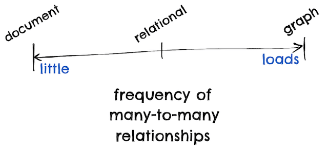

# Chapter 2
## Data Models and Query Languages
### Relational Models versus Document Model
Several driving forces behind NoSQLs adoption in 2010s
* Need for greater scalability (for large datasets, high write throughput)
* FOSS
* Specialised query operations
* Overcoming restrictiveness of relational schema; more dynamic and expressive data model.
#### Object-Relational impedance mismatch
Most application development today is done in an object-oriented language, while the SQL data model takes a table-based format. There are a few difficulties mapping data between these two logical domains.
* Object models offer various levels of granularity, while the relational model offers only two (tables and columns)
* Object models permit inheritance, relational models don’t
* Object models can be compared in terms of object identity and object equality, relational models only recognises identity via primary keys
* Object models have offer directional association, while in a relational model foreign key associations are not directions

Database normalisation requires many-to-one relationships, which don’t fit nicely into the document model. If the database itself doesn’t support joins you have to emulate a join in application code by making multiple queries to the database.

#### The network model
* Standardised by the *Conference on Data Systems Languages* (CODASYL) and implemented by several difference database vendors.
* Generalisation of hierarchical model
* Links between records in the network model were not foreign keys but akin to pointers in programming. You had to follow a path from root record to desired destination (*access path*).
  * Like a linked list
  * Move cursor through DB by iterating over lists of records, following access paths
* Difficult to make changes to an application’s data model
#### The relational model
* A relation is simply a collection of tuples
* Insert new rows into any table without worrying about foreign key relationships to and from other tables
* Query optimiser automatically decides which parts of the query to execute, in which order, and with which indexes
  * Can define indexes yourself if you wish

Document databases were a sort-of reversion to the hierarchical model insofar as they store nested records (one-to-many relationships) within their parent record rather than a separate table. Many-to-one and many-to-any relationships are stored in both relational and document databases in a similar way, though: the related item is referenced by a unique identifier (foreign key or document reference, respectively) which is resolved at read time using a join or follow-up queries.

So, the main argument for the relational model is strong support for joints and many-to-one, many-to-many relationships. For the document model, schema flexibility, better performance due to locality, and that for some applications it’s in closer alignment to the data structures used.

#### Schema flexibility in the document model
Most document databases don’t enforce any schema on the data in the documents, meaning arbitrary keys and values can be added to a document, and when reading clients have no guarantees as to what fields the documents may contain. We may describe this as *schema-on-read*, where the structure of the data is implicit and interpreted on read, as opposed to *schema-on-write*, the traditional relational approach where the schema is explicit and the database ensured written data conforms to it.

#### Data locality
Documents are usually stored as a single continuous string, encoded as JSON, XML, or some binary variant (e.g. Mongo’s BSON). There is a performance advantage to this storage locality if we need large parts of the document at the same time, as the database typically needs to load an entire document even if only a portion of it is needed. Similarly, updates require the entire document to be rewritten.

Only modifications that don’t change the encoded size of a document can be easily performed in place, so it’s generally recommended that they’re kept small and to avoid writes that increase their size.

#### Convergence of document and relational databases
Most relational database systems have supported XML for a while, and many also support JSON, which includes functions to make local modifications to XML/JSON data and the ability to index and query them. This allows applications to use data models in a relational context which are similar to what would be used in a document context.

Some documents databases support relational-like joins in their query language.

### Query Languages for Data
The declarative style of SQL queries means we specify the pattern of the data we want but not how to achieve that goal, leaving it up to the database’s query optimiser to decide which indexes and which join methods to use. This is concise, easy to work with, and hides implementation details of the database engine, making it possible for the database system to introduce changes without affecting queries. Declarative code is also much more amenable to parallelisation.

#### MapReduce Querying
*MapReduce* is a programming model for processing large amounts of data in bulk across many machines. A limited form is supported by some NoSQL datastores to perform read-only queries across many documents.

The `map()` and `reduce()` functions in a MapReduce query are fairly restricted. They must be *pure* functions, which is to say they must rely only on their inputs, can’t perform additional queries, can’t have side effects. MapReduce is fairly low-level for distributed execution, but very useful.

Mongo has added support for a declarative query language similar to MapReduce called the *aggregation pipeline*.

```mongodb
/* Example of MapReduce query */
db.observations.mapReduce( function map() {
var year = this.observationTimestamp.getFullYear(); var month = this.observationTimestamp.getMonth() + 1; emit(year + "-" + month, this.numAnimals);
},function reduce(key, values) {
return Array.sum(values); },
        {
            query: { family: "Sharks" },
            out: "monthlySharkReport"
} );

/* Example of aggregation pipeline query */
    db.observations.aggregate([
        { $match: { family: "Sharks" } },
        { $group: {
            _id: {
                year:  { $year:  "$observationTimestamp" },
                month: { $month: "$observationTimestamp" }
},
totalAnimals: { $sum: "$numAnimals" } }}
]);
```

### Graph-Like Data Models
If many-to-many relationships are comment in our data, a graph-like model may be appropriate. Examples of a graph include social graphs, web graphs, and road or rail networks. Graphs are not at all restricted to homogenous data at each vertex.

<!-- {"width":472} -->

<!-- {"width":352} -->

#### Property Graphs
Each vertex consists of
* Unique identifier
* Set of outgoing edges
* Set of incoming edges
* Collection of properties (key-value pairs)

Each edge consists of
* Unique identifier
* Tail vertex
* Head vertex
* Label to describe the relationship between vertices
* Collection of properties (key-value pairs)

#### Triple-Stores
The triple-store model is very similar to the property graph model. All information is stored in a three-part statement `(subject, predicate, object)`. The subject is a vertex and the object is either a value in a primitive datatype or another vertex in the graph.

#ddia
