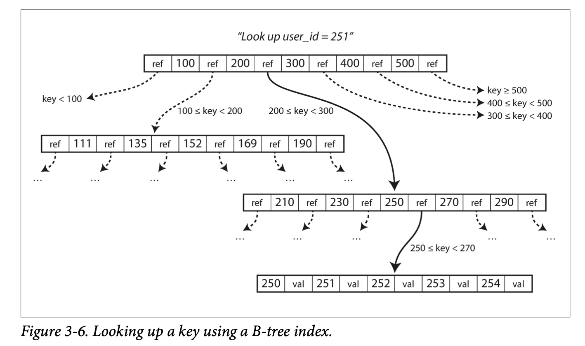

# Chapter 3
## Storage and Retrieval
Two major families of storage engines are *log-structured* storage engines, which is an append-only sequence of records, and *page-oriented* storage engines, like B-trees.

### Indexes
#### Hash indexes
If our data storage consists of only appending to a file, the simplest indexing strategy would be to keep an in-memory hash map where every key is mapped to a byte offset in the data file—the location at which the value can be found. Since we’re only ever appending to a file, we may wish to perform a *compaction* and keep only the most recent value for a key.

Other details of a naive index implementation using hash tables.
| Feature                   | Details                                                      |
|---------------------------|--------------------------------------------------------------|
| File format               | CSV isn’t great. Faster and simpler to use a binary format which encodes the length of a string in bytes, followed by raw string. |
| Deleting records          | Append a special deletion record to data file (*tombstone*) which tells merging process to discard previous values for deleted key. |
| Crash recovery            | If the database is restarted the in-memory hash maps are lost. Could store snapshot of each segment’s hash map on disk for loading into memory. |
| Partially written records | Could include checksums, allowing corrupted parts of the log to be detected and ignored. |
| Concurrency control       | Commonly implemented with only one writer thread due to sequential nature. Data file segments can be read concurrently by multiple threads since they’re append-only and otherwise immutable. |

Append-only logs are useful because
* Appending and segment merging are sequential write operations, faster than random writes on certain hardware and possibly SSDs
* Concurrency and crash recovery are simple
* Merging old segments avoid data files getting fragmented over time

Their limitations are
* The hash table must fit in memory. On-disk hash maps are difficult to make perform well.
* Range queries inefficient

### SSTables and LSM-Trees
If we require that the sequence of key-value pairs that make up each structure storage segment are sorted by key then we arrive at a *Sorted String Table*, or SSTable. The advantages of these over log segments with hash indexes are:
1. Merging segments is simple and efficient
2. No longer need to keep an index of all keys in memory (keys are alphabetical, so we can use a subset as markers)
3. We can compress a group of records into blocks and compress the blocks before writing to disk

So the storage engine will work as follows
1. When a write comes in, add it to an in-memory balanced tree data structure (*memtable*)
2. When memtable exceeds some threshold, write it out to disk as an SSTable
   1. Tree already maintains key-value pairs sorted by key
   2. New SSTable becomes most recent segment in database
   3. While being written we can continue in a new memtable instance
3. When read comes in, try to find key in memtable, then in most recent on-disk segment, then next, etc.
4. From time to time run a merging and compaction process

#### Making an LSM-tree out of SSTables
Storage engines based on this principle of merging and compacting sorted filed are called *LSM storage machines*. *Bloom filters* are used to tell us whether a key doesn’t exist without having to traverse the whole tree).

> Even though there are many subtleties, the basic idea of LSM-trees—keeping a cascade of SSTables that are merged in the background—is simple and effective. Even when the dataset is much bigger than the available memory it continues to work well. Since data is stored in sorted order, you can efficiently perform range queries (scanning all keys above some minimum and up to some maximum), and because the disk writes are sequential the LSM-tree can support remarkably high write throughput. 

### B-Trees
Most common indexing structure. B-trees break database into fixed-sized blocks or pages (~4KB) and read or write one page at a time. The idea is that the design coincides closely with underlying hardware, also arranged in fixed-size blocks.
<!-- {"width":354} -->
A page containing individual keys is called a *leaf page*. The no. of references to child pages in one page is called the *branching factor*.
<!-- {"width":354} -->

B-trees overwrite a page on disk with new data with the assumption that the overwrite does not change the location of the page: all references to that page remain intact when the page is overwritten. In contract to LSM-trees which append to files but don’t modify in place.

If a page is overfull then we need to split it and update the parent page’s references which leaves us at risk, in the case of a crash, of an orphan page. B-trees implement a *write-ahead log* (or *redo log*) to mitigate against this. It is an append-only file to which every B-tree modification is written before application to the tree.

#ddia